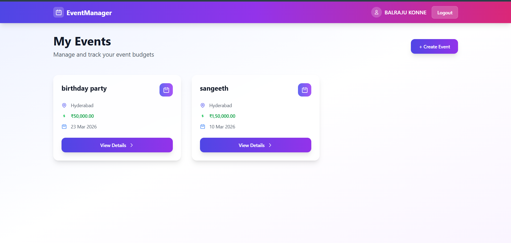
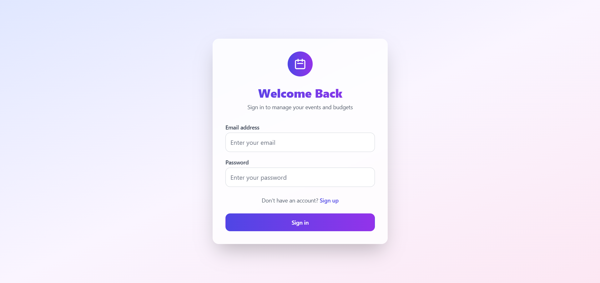
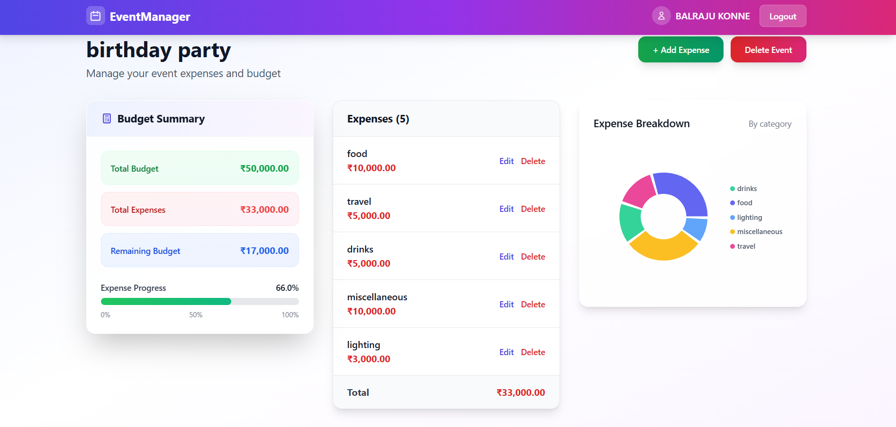
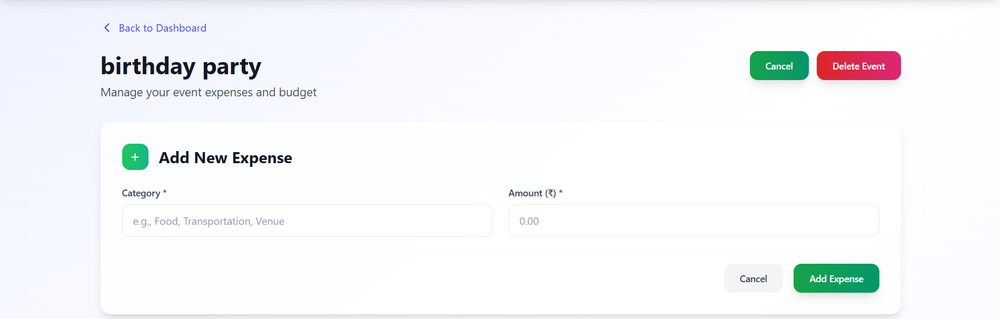
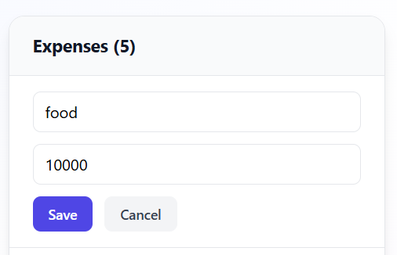
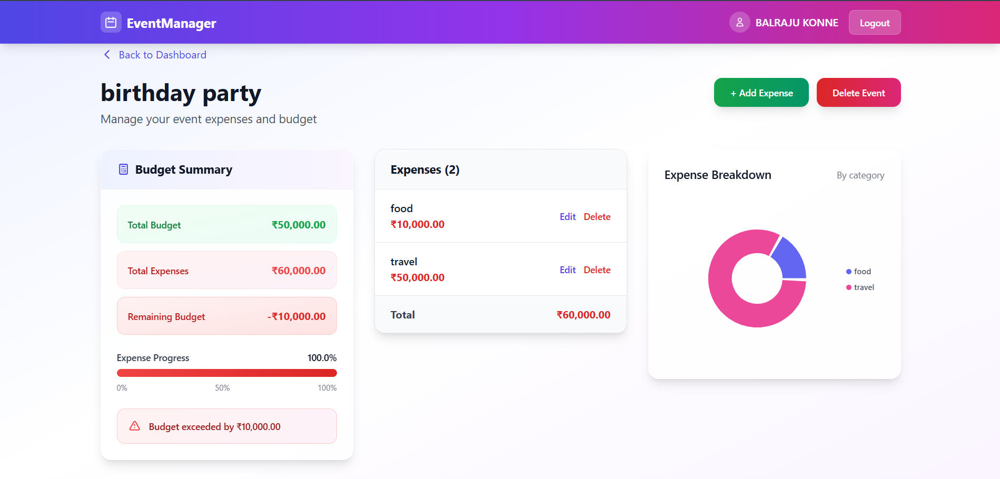

# 📅 EventManager — Event Budget Planner

> A production-ready full-stack web application to create events, track expenses, and visualize budget breakdowns in real time.

<!-- Screenshot: Full dashboard view showing event cards -->


---

## 🌐 Live Demo

| | Link |
|---|---|
| 🖥️ **Frontend** | [eventmanager.vercel.app](https://your-app.vercel.app) |
| ⚙️ **Backend API** | [eventbudget-api.onrender.com/api](https://your-api.onrender.com/api) |

---

## 📌 What Is This Project?

**EventManager** is a full-stack MERN application that helps users plan and manage event finances. Users can register, create multiple events (weddings, parties, conferences, etc.), log expenses by category, and instantly see how much of their budget remains — all in a clean, responsive interface.

This project demonstrates end-to-end full-stack development skills including REST API design, JWT authentication, MongoDB data modeling, React state management, and cloud deployment on industry-standard platforms.

---

## 🎯 Key Highlights 

- ✅ **Full-stack MERN** — MongoDB, Express, React (Vite), Node.js
- ✅ **JWT Authentication** — secure register/login with protected routes
- ✅ **RESTful API** — properly structured nested routes with auth middleware
- ✅ **Real-time UI updates** — optimistic state updates on edit/delete without page reload
- ✅ **Data visualization** — interactive pie chart and budget progress bar using Recharts
- ✅ **Production deployed** — live on Vercel + Render + MongoDB Atlas
- ✅ **Responsive design** — works on desktop and mobile using TailwindCSS
- ✅ **Clean architecture** — centralized API layer, reusable components, separated concerns

---

## 📸 Screenshots
### 1. Login Page
<!-- Screenshot: Login form with email/password fields and sign-in button -->


### 2. Dashboard — All Events
<!-- Screenshot: Dashboard showing multiple event cards with budget info -->


### 3. Event Details — Budget Summary + Expense List + Chart
<!-- Screenshot: Full EventDetails page showing the 3-column layout: SummaryCard, ExpenseList, PieChart -->


### 4. Add Expense Form
<!-- Screenshot: The expanded Add Expense form with Category and Amount fields -->


### 5. Inline Edit Expense
<!-- Screenshot: An expense row in edit mode showing the Save/Cancel buttons -->


### 6. Over Budget Warning
<!-- Screenshot: Red warning banner appearing when total expenses exceed the event budget -->


---

## ✨ Features

### 🔐 Authentication
- Secure user registration and login
- Passwords hashed with bcryptjs
- JWT token stored in localStorage, auto-attached to every request via Axios interceptor
- Protected routes — unauthenticated users redirected to login page

### 📋 Event Management
- Create events with name, total budget, location, and date
- View all your events on a dashboard
- Delete events (removes all associated expenses)

### 💸 Expense Tracking
- Add expenses with category and amount
- Edit expenses inline — no page reload required
- Delete individual expenses with confirmation prompt
- Unsaved edit changes prompt before cancel

### 📊 Budget Analytics
- Real-time budget summary — Total Budget / Total Expenses / Remaining Balance
- Expense progress bar — turns yellow at 75%, red at 90%
- Over-budget alert banner with exact overage amount
- Pie chart showing expense breakdown by category
- Tooltip on hover shows exact ₹ amount per category

---

## 🛠️ Tech Stack

### Frontend
| Technology | Purpose |
|---|---|
| React 18 (Vite) | UI framework and fast build tool |
| TailwindCSS | Utility-first responsive styling |
| Axios | HTTP client with request interceptors |
| Recharts | Interactive charts and data visualization |
| React Router v6 | Client-side routing with protected routes |

### Backend
| Technology | Purpose |
|---|---|
| Node.js | JavaScript runtime |
| Express.js | REST API framework |
| MongoDB + Mongoose | Cloud NoSQL database + ODM |
| jsonwebtoken | JWT creation and verification |
| bcryptjs | Secure password hashing |
| dotenv | Environment variable management |
| cors | Cross-origin request handling |

### Deployment
| Service | Purpose |
|---|---|
| Vercel | Frontend hosting with auto-deploy from GitHub |
| Render | Backend Node.js API hosting |
| MongoDB Atlas | Managed cloud database (M0 free tier) |

---

## 🏗️ Architecture Overview

```
┌─────────────────────┐        HTTPS         ┌──────────────────────┐
│                     │ ──────────────────▶  │                      │
│   React Frontend    │                      │   Express REST API   │
│   (Vercel)          │ ◀──────────────────  │   (Render)           │
│                     │     JSON responses   │                      │
└─────────────────────┘                      └──────────┬───────────┘
                                                        │
                                                   Mongoose ODM
                                                        │
                                                        ▼
                                             ┌──────────────────────┐
                                             │   MongoDB Atlas      │
                                             │   (Cloud Database)   │
                                             └──────────────────────┘
```

**Frontend:** Centralized Axios instance (`api.js`) handles all HTTP calls. JWT is injected automatically via request interceptor. Pages are protected by a `ProtectedRoute` wrapper component.

**Backend:** Routes mounted under `/api` prefix. `authMiddleware` validates JWT on all protected routes. Expenses are stored as embedded subdocuments inside Event documents — no separate collection needed.

---

## 📁 Project Structure

```
EventManagementSystem/
├── backend/
│   ├── controllers/
│   │   ├── authController.js        # register, login
│   │   └── eventController.js       # CRUD for events + expenses
│   ├── middleware/
│   │   └── authMiddleware.js        # JWT verification
│   ├── models/
│   │   └── Event.js                 # Mongoose schema (expenses embedded)
│   ├── routes/
│   │   ├── authRoutes.js
│   │   └── eventRoutes.js           # nested expense routes
│   ├── server.js                    # Express app entry point
│   └── package.json
│
└── frontend/
    ├── src/
    │   ├── components/
    │   │   ├── ExpenseChart.jsx      # Recharts donut pie chart
    │   │   ├── ExpenseList.jsx       # Inline edit/delete expense list
    │   │   ├── Navbar.jsx
    │   │   ├── ProtectedRoute.jsx    # Auth guard component
    │   │   └── SummaryCard.jsx       # Budget summary widget
    │   ├── pages/
    │   │   ├── Dashboard.jsx         # All events overview
    │   │   ├── EventDetails.jsx      # Single event + expenses + chart
    │   │   ├── Login.jsx
    │   │   └── Signup.jsx
    │   ├── services/
    │   │   └── api.js                # Centralized Axios instance + interceptors
    │   ├── utils/
    │   │   └── formatters.js         # INR currency formatter
    │   └── App.jsx                   # Route definitions
    ├── vercel.json                   # SPA rewrite rule for React Router
    └── package.json
```

---

## 🔌 API Reference

### Auth Endpoints
| Method | Endpoint | Description | Auth Required |
|---|---|---|---|
| POST | `/api/auth/register` | Register a new user | ❌ |
| POST | `/api/auth/login` | Login and receive JWT token | ❌ |

### Event Endpoints
| Method | Endpoint | Description | Auth Required |
|---|---|---|---|
| GET | `/api/events` | Get all events for logged-in user | ✅ |
| POST | `/api/events` | Create a new event | ✅ |
| PUT | `/api/events/:id` | Update event name, budget, location, date | ✅ |
| DELETE | `/api/events/:id` | Delete event and all its expenses | ✅ |

### Expense Endpoints
| Method | Endpoint | Description | Auth Required |
|---|---|---|---|
| GET | `/api/events/:id/expenses` | Get all expenses for an event | ✅ |
| POST | `/api/events/:id/expenses` | Add a new expense | ✅ |
| PUT | `/api/events/:id/expenses/:expenseId` | Edit an expense | ✅ |
| DELETE | `/api/events/:id/expenses/:expenseId` | Delete an expense | ✅ |
| GET | `/api/events/:id/summary` | Get budget totals summary | ✅ |

> All protected routes require the header: `Authorization: Bearer <token>`

---

## 🗄️ Database Schema

### User
```js
{
  _id: ObjectId,
  username: String,
  email: String,        // unique index
  password: String,     // bcrypt hashed, never stored plain
  createdAt: Date
}
```

### Event (with embedded Expenses)
```js
{
  _id: ObjectId,
  userId: ObjectId,     // references User — only owner can access
  eventName: String,
  budget: Number,
  location: String,
  date: Date,
  expenses: [           // embedded subdocuments — no separate collection
    {
      _id: ObjectId,    // auto-generated by Mongoose
      category: String,
      amount: Number
    }
  ]
}
```

> Expenses are embedded inside Event documents rather than a separate collection. This avoids extra database queries since expenses are always loaded with their event and are never queried independently.

---

## ⚙️ Local Development Setup

### Prerequisites
- Node.js v18+
- npm v9+
- MongoDB Atlas free account

### 1. Clone the Repository
```bash
git clone https://github.com/your-username/EventManagementSystem.git
cd EventManagementSystem
```

### 2. Backend Setup
```bash
cd backend
npm install
```

Create `backend/.env`:
```env
MONGODB_URI=mongodb+srv://<username>:<password>@cluster0.xxxxx.mongodb.net/eventdb?retryWrites=true&w=majority
JWT_SECRET=your-long-random-secret-key-here
PORT=5000
```

Run the backend:
```bash
node server.js
# Expected output:
# Event routes loaded
# Server listening on port 5000
# Connected to MongoDB
```

### 3. Frontend Setup
```bash
cd frontend
npm install
```

Create `frontend/.env`:
```env
VITE_API_BASE_URL=http://localhost:5000/api
```

Run the frontend:
```bash
npm run dev
# Frontend running at http://localhost:5173
```

---

## 🚀 Deployment Guide

### Step 1 — MongoDB Atlas Setup
1. Create a free M0 cluster at [cloud.mongodb.com](https://cloud.mongodb.com)
2. Create a database user — use **letters and numbers only** in the password (special characters break the URI)
3. Network Access → Add IP `0.0.0.0/0` to allow connections from Render
4. Get your connection string — replace `<password>` and add `/eventdb` before the `?`

### Step 2 — Backend on Render
1. New Web Service → connect your GitHub repo
2. Build settings:

| Field | Value |
|---|---|
| Root Directory | `backend` |
| Build Command | `npm install` |
| Start Command | `node server.js` |

3. Environment variables:

| Key | Value |
|---|---|
| `MONGODB_URI` | Your Atlas connection string |
| `JWT_SECRET` | A long random secret string |
| `FRONTEND_URL` | Your Vercel URL (add after Step 3) |

### Step 3 — Frontend on Vercel
1. New Project → connect your GitHub repo
2. Build settings:

| Field | Value |
|---|---|
| Root Directory | `frontend` |
| Framework Preset | Vite |
| Build Command | `npm run build` |
| Output Directory | `dist` |

3. Environment variables:

| Key | Value |
|---|---|
| `VITE_API_BASE_URL` | `https://your-api.onrender.com/api` |

4. Ensure `vercel.json` exists in the frontend root (fixes page refresh 404):
```json
{
  "rewrites": [{ "source": "/(.*)", "destination": "/index.html" }]
}
```

---

## 🐛 Common Issues & Fixes

| Problem | Cause | Fix |
|---|---|---|
| `MongoDB authentication failed` | Wrong or mistyped password in URI | Regenerate password using letters/numbers only |
| `Could not connect to Atlas cluster` | Render's IP not whitelisted | Add `0.0.0.0/0` in Atlas → Network Access |
| `404` on expense edit or delete | Express route shadowing | Nested routes must be declared before `/:id` wildcard routes |
| `CORS error` in browser console | Vercel URL not whitelisted on backend | Set `FRONTEND_URL` env var on Render to your exact Vercel URL |
| Refreshing `/event/:id` gives 404 | Vercel doesn't know about React Router | Add `vercel.json` with the rewrite rule |
| API calls go to `localhost` in production | `VITE_API_BASE_URL` not set | Add env var on Vercel and redeploy |
| Users logged out after every redeploy | `JWT_SECRET` regenerated each deploy | Keep `JWT_SECRET` fixed — changing it invalidates all tokens |

---

## 💡 Technical Decisions & Learnings

### Embedded subdocuments for expenses
Expenses only exist in the context of an event and are always fetched together with it. Embedding avoids an extra database query and keeps the data model straightforward. Mongoose automatically assigns `_id` to each subdocument.

### Centralized Axios interceptors
Rather than manually attaching the JWT to every API call across components, a single Axios interceptor handles it globally. This keeps components clean, prevents accidental unauthenticated requests, and makes token management easy to change in one place.

### Express route ordering — a real production bug
During development, `DELETE /api/events/:id` was silently shadowing `DELETE /api/events/:id/expenses/:expenseId`. Express evaluates routes top-down — the wildcard `/:id` matched before the specific nested route was reached, returning 404. The fix: always register specific nested routes **before** wildcard `/:id` routes for the same HTTP method. This is a common and hard-to-spot bug in Express applications.

### Optimistic UI updates
On expense edit, the UI updates immediately from the API response without refetching all data. On delete, a full refetch ensures the budget summary stays accurate. This balances perceived performance with data consistency.

---

## 👨‍💻 Author

**Konne Balraju**
- 🐙 GitHub: [@Balrajukonne2629](https://github.com/Balrajukonne2629)
- 🎓 Chaitanya Bharathi Institute of Technology, Hyderabad

---

## 📄 License

This project is open source and available under the [MIT License](LICENSE).

---

<div align="center">
  <sub>Built end-to-end with the MERN stack — from schema design to production deployment</sub>
</div>
